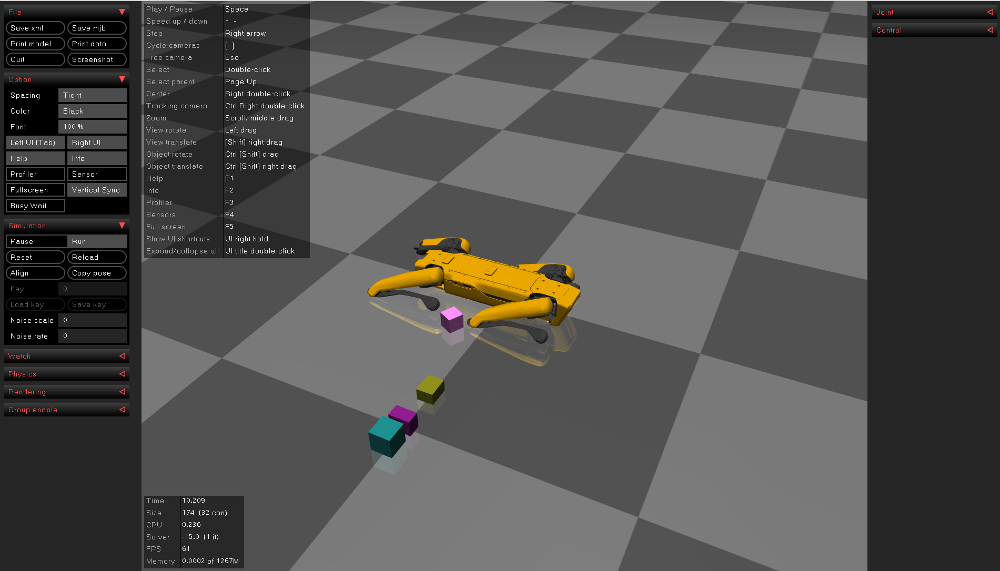

# Spot MuJoCo ROS2

<div align="center">
    
</div>

## Introduction

This package is developed with [ROS2](https://docs.ros.org/en/humble/index.html) based on [spot-sdk](https://github.com/boston-dynamics/spot-sdk). The original [urdf](https://github.com/boston-dynamics/spot-sdk/tree/master/files) has no inertia and mass information, so we generate this information based on its geometric shape.

The files include:

1. The XML file `(description/model/xml/spot_mini/spot_mini.xml)` of [Spot Mini](https://www.bostondynamics.com/products/spot) for the simulation in [MuJoCo](https://mujoco.org/).
2. A class named `MuJoCoMessageHandler` is also provided, which publishes the robot joint state and imu message. The `odom` message is just the real pose of the robot in simulation. More details can be found in the cpp file `src/simulation/mujoco/src/MuJoCoMessageHandler.cpp`.
3. ROS2 ([version](https://docs.ros.org/en/humble/index.html)) is needed to run this package.

## Installation

```
# Create your own workspace
cd ~/ & mkdir -p your_workspace/src
```

```
# Clone this package to your_workspace/src
cd ~/your_workspace/src & git clone https://github.com/MindSpaceInc/Spot-MuJoCo-ROS2.git
```

```
# Build (DO NOT remove `--symlink-install`)
colcon build --symlink-install 
```

```
# Setup env
source ../install/setup.bash
```

```
# Run simulation 
ros2 launch mujoco simulation_launch.py
```

Now your can open a new terminal and use command `ros2 topic list` to see the below topics
```
/parameter_events
/rosout
/simulation/actuators_cmds
/simulation/imu_data
/simulation/joint_states
/simulation/odom

```

